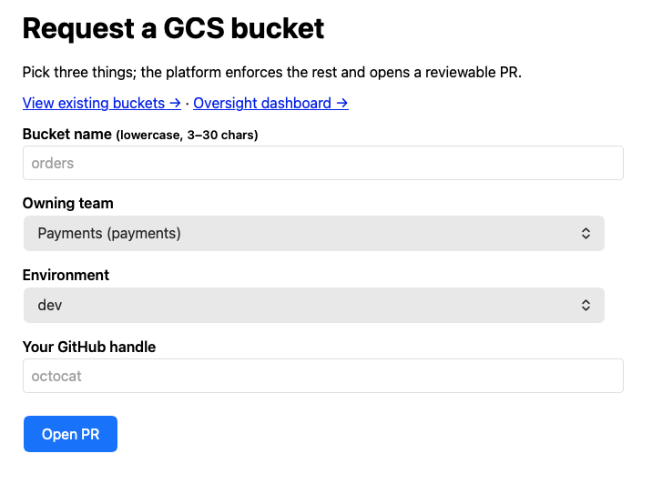
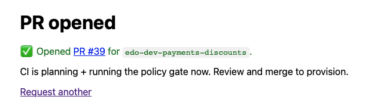
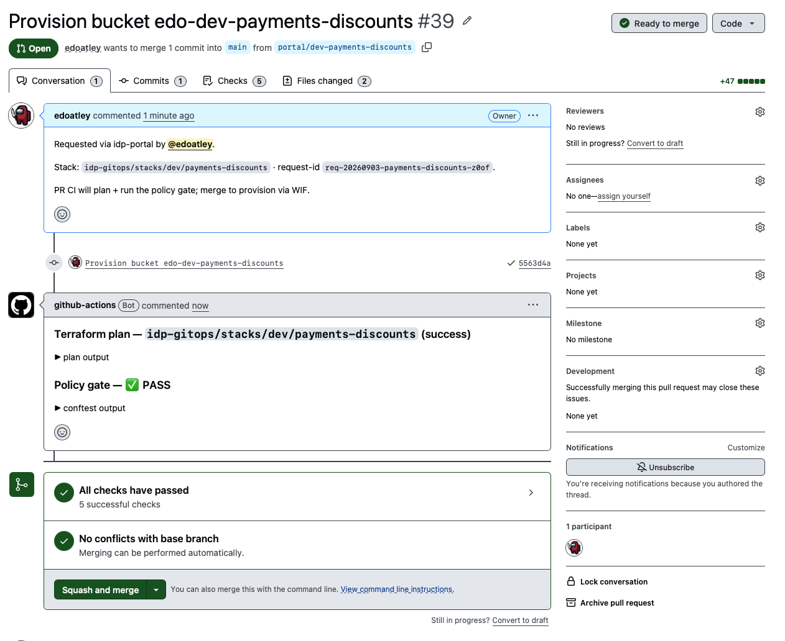

# 3 — Request a bucket via the portal (write path)

*(Phase 3 — `idp-portal/`)*

The thin portal lets a developer provision a compliant bucket with **no Terraform knowledge**. It
owns no database and needs **no GCP credentials** — it just generates the same stack a human would
hand-write and opens a PR.

## Do this

```bash
cd idp-portal && npm ci
# from the repo root, load the token and run the portal:
source ../.env
export GITHUB_REPO=edoatley/idp-prototype
npm run dev        # http://localhost:3000
```

Open `http://localhost:3000` and you should get:



Now pick a **name**, **owning team** (dropdown from `teams.yaml`) and **environment**, add your
GitHub handle, and submit. The portal shows a link to the PR it opened:



> To capture a clean end-to-end run, choose a fresh name (e.g. `search` / `dev` / `index`); you
> can decommission it later in step 7.

The resulting [PR](https://github.com/edoatley/idp-prototype/pull/39) looks like this:



## What's happening & why

On submit the portal **validates** (mirroring the module), **generates** a stack indistinguishable
from a hand-written one (`main.tf` calling the module + `metadata.yaml`, the inventory record),
and **opens a PR** via the GitHub API — a single commit on a `portal/*` branch. That's the whole
write path: the portal produces artifacts, and the *backend* (CI + Terraform + WIF) does the rest.
Because the backend is portal-agnostic, the portal added zero backend changes.

> **Want the mechanism rather than the tour?**
> [`docs/portal-to-terraform.md`](../portal-to-terraform.md) has the complete generated files,
> where the templates live (and why they are inline literals), the branch/commit/PR naming
> contracts, the six-call git-data API sequence, and the known sharp edges.

The Terraform extract below was in the PR:

```hcl
module "bucket" {
  source = "../../../modules/gcs-bucket"

  name        = "discounts"
  owning_team = "payments"
  environment = "dev"
  request_id  = "req-20260903-payments-discounts-z0of"
}

output "bucket_name" {
  description = "Name of the provisioned bucket."
  value       = module.bucket.bucket_name
}
```

## Reference links

- Portal: [`idp-portal/`](../../idp-portal/README.md)
- A real portal-opened PR: [#22 Provision bucket edo-dev-checkout-orders](https://github.com/edoatley/idp-prototype/pull/22)
- Portal PRs: [#17 scaffold/generator](https://github.com/edoatley/idp-prototype/pull/17),
  [#21 GitHub + form](https://github.com/edoatley/idp-prototype/pull/21)

---
Next: [4 — PR CI: plan + policy gate →](04-pr-plan-and-policy-gate.md)
