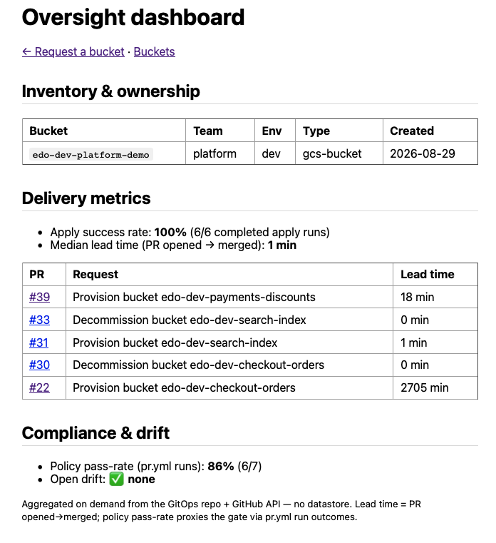

# 6 — The oversight dashboard

*(Phase 5 — `idp-portal` `/dashboard`)*

The headline: one page answering *what exists, who owns it, how the platform performs, and whether
it's compliant* — aggregated **on demand** from sources the pipeline already populates. No new
datastore, no GCP creds.

## Do this

```bash
# from repo root, with the token loaded (see step 3):
set -a; . ./.env; set +a
export GITHUB_REPO=edoatley/idp-prototype
cd idp-portal && npm run dev
```

Open `http://localhost:3000/dashboard` and capture the three panels.

## What's happening & why

- **Inventory & ownership** — read straight from each stack's `metadata.yaml` (the repo *is* the
  inventory).
- **Delivery metrics** — apply success rate, lead time (PR opened→merged) and recent requests,
  computed live from the GitHub API.
- **Compliance & drift** — a policy pass-rate (from `pr.yml` run outcomes) and open `Drift:`
  Issues. The pass-rate being **< 100%** is a feature: the miss is the deliberately-public PR the
  gate **blocked** — oversight that evidences the guardrail working.

Everything here is **portal-agnostic** (metadata, PRs, Actions, Issues), so a future Backstage
front-end could surface the same signals — proving the backend, not the portal, is the durable
value.



## Reference links

- Aggregation modules: [`metrics.ts`](../../idp-portal/src/metrics.ts),
  [`compliance.ts`](../../idp-portal/src/compliance.ts),
  [`inventory.ts`](../../idp-portal/src/inventory.ts)
- PRs: [#35 aggregation modules](https://github.com/edoatley/idp-prototype/pull/35),
  [#36 dashboard page](https://github.com/edoatley/idp-prototype/pull/36)

---
Next: [7 — Day-2: drift & decommission →](07-day2-drift-and-decommission.md)
